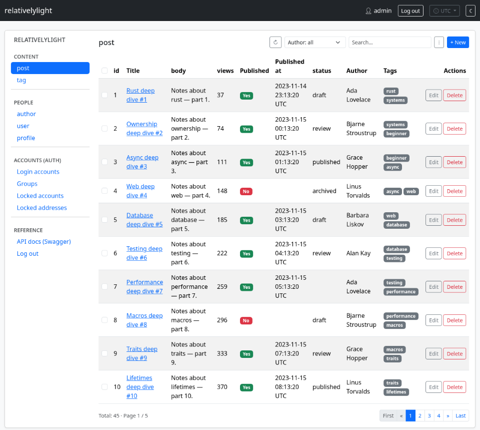
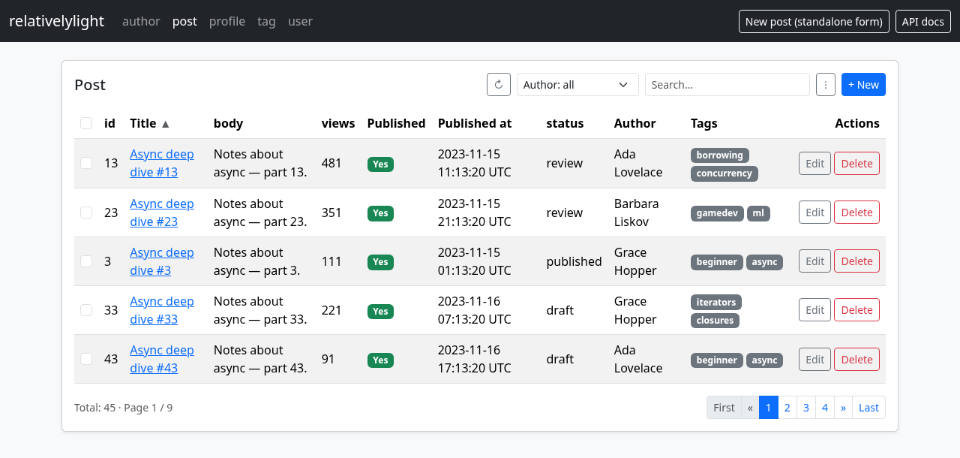
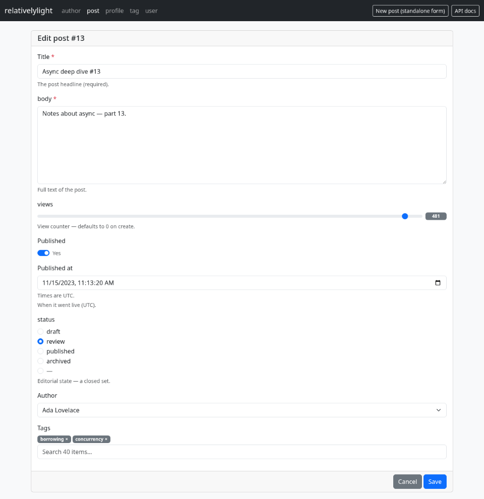
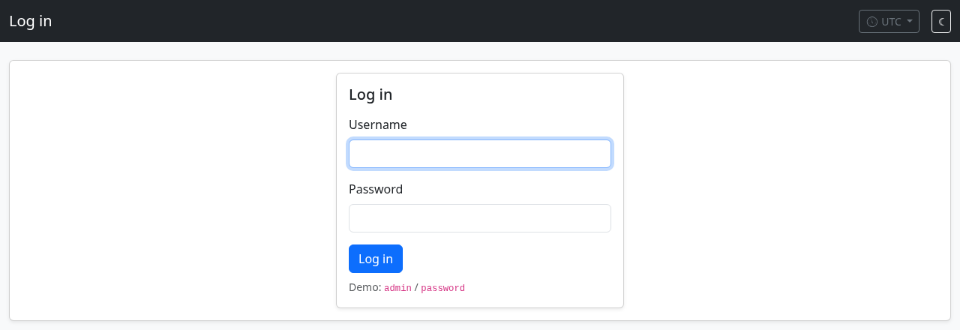
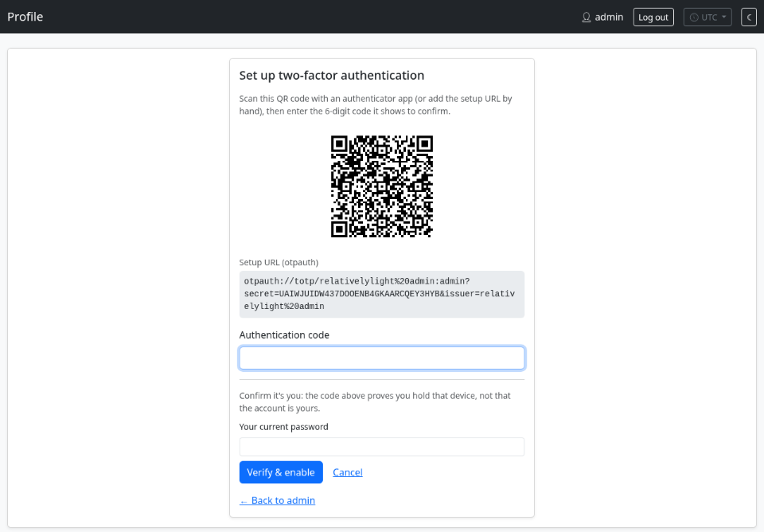

# relativelylight

A web back-office toolkit for Rust. **Auto-generate a server-rendered CRUD admin from your ORM
entities — with no per-model code**, gated by built-in authentication. It composes *into* your app:
you keep your own router and page shell; `relativelylight` contributes the HTML.

No JavaScript framework, no JSON API in between: the columns it introspects go straight into rendered
HTML, and writes come back as posted forms (`POST` → `303` → `GET`). Your page needs Bootstrap 5's
stylesheet and nothing else.

## What it looks like

Nothing below is hand-written per model: the tables, the forms and their widgets are generated from
the entities, and the login / 2FA screens come with `auth`. Every shot is a runnable example —
`cargo run -p adminpanel-example` and `cargo run -p crud-example`.

[](docs/img/admin.png)

<sub>`crud::ui::Admin` — every registered model behind one side panel, login-gated
(`examples/adminpanel`).</sub>

<table>
<tr>
<td width="50%"><a href="docs/img/table.png"></a><br>
<sub><b>Table</b> — sortable headers, a filter on the <code>author</code> <i>relation</i>, search, bulk
actions, CSV, pager.</sub></td>
<td width="50%"><a href="docs/img/form.png"></a><br>
<sub><b>Form</b> — the same form the table opens in a dialog, standalone on your own page; widgets
picked per column type (or overridden).</sub></td>
</tr>
<tr>
<td width="50%"><a href="docs/img/login.png"></a><br>
<sub><b>Login</b> — an HTML fragment wrapped in <i>your</i> page shell; sessions, lockout and CSRF
included.</sub></td>
<td width="50%"><a href="docs/img/totp.png"></a><br>
<sub><b>TOTP 2FA</b> — self-service enrolment from <code>/profile</code>: QR + <code>otpauth://</code>
URL, verified (and re-authenticated) before it's on.</sub></td>
</tr>
</table>

The crate is **`relativelylight`**, organized into feature-gated modules:
- **`crud`** (default) — the CRUD engine, SeaORM backend, the server-rendered admin UI (`ui`), CSV.
- **`auth`** — sessions, login, TOTP 2FA, OIDC SSO, and a per-model authorization gate (usable
  without `crud`); see [docs/AUTH.md](docs/AUTH.md).
- **`observe`** / **`time`** — a write-observer audit hook, and server-side timezone rendering of
  UTC timestamps; see [docs/TIME.md](docs/TIME.md).

> Status: the `crud` engine + `ui` web admin are implemented and used by the examples; `auth` covers
> argon2 login/session, `Authz` gate presets, a self-service profile (password + TOTP 2FA), and OIDC
> single sign-on (feature `sso`). File-handling is planned — see the roadmap in
> [docs/PRD.md](docs/PRD.md).

## What you get

- **A web admin** (`ui`): tables with sortable headers, filter controls, search, a pager, bulk
  actions, CSV, custom cell renderers in Rust, and a create/edit `<dialog>` rendered server-side —
  plus an `Admin` side panel composing many models into one page, optionally under one filter shared
  across all of them.
- **Full CRUD per entity** behind a typed `Engine` — list/get/create/update/delete, relations written
  by name (`"author": 1`, `"tag": [1,3]`). Publish your own JSON API over it if your clients need one;
  its shape is yours to decide.
- **Search, filter, sort, pagination**, and **set-based bulk delete**, all carried in the URL:
  `?filter[author]=7` matches the FK behind the relation name, and `?sort=author` orders by the label
  the cell shows rather than the id behind it. Every view is therefore a link.
- **Typed columns** (ordered fields + relations, logical types) that the renderer matches on
  exhaustively — no per-model schema code, and no untyped middle.
- **Validation & transforms** — field + cross-field validators, `on_read`/`on_write` hooks (redact,
  hash), typed coercion. A rejected write re-renders the dialog with the messages beside the fields.
- **CSV import/export** through the same validation pipeline, with timestamps in the operator's zone,
  so a file matches the screen.
- **One request-pipeline layer** (`middleware`): `resolve_real_ip`, which decides who the caller is once
  and is **required**. The crate logs nothing itself — `examples/audit` is a request log you can copy.

The core is backend-agnostic; SeaORM is one backend behind a small `Accessor` seam.

## Quick start

```toml
# Cargo.toml
[dependencies]
relativelylight = { version = "0.3", features = ["ui", "csv"] }
sea-orm = { version = "1.1", features = ["macros", "with-json"] }
```

```rust
use relativelylight::crud::seaorm::{Crud, MetaModel};
use relativelylight::crud::ui::{Admin, Outcome, ViewState};
use relativelylight::authz::Open;           // gate per model; Open = ungated

// Auto-build a model per entity; only N:M is declared by hand.
let author = MetaModel::new(author::Entity);
let tag    = MetaModel::new(tag::Entity);
let mut post = MetaModel::new(post::Entity);
post.relate(&tag);

let mut crud = Crud::new(db);
crud.register(author, Open);                // pass an auth gate to restrict — see docs/AUTH.md
crud.register(post, Open);
crud.register(tag, Open);
let engine = std::sync::Arc::new(crud.into_engine());
```

Then **two handlers** on a route of your own — a `get` that renders into your shell, a `post` that
hands the body back to the library:

```rust
fn panel(engine: &Engine) -> Admin<'_> {    // one definition, used by both handlers
    Admin::new(engine).title("Admin").entities()
}

let app = axum::Router::new()
    .route("/admin", get(show).post(save))
    .with_state(engine)
    // REQUIRED, and outermost: resolves the caller's address once into a `RealIp` extension, which the
    // write path, the auth lockout, your own handlers and whatever you log all read. `TrustProxy(true)`
    // believes your reverse proxy's forwarded hop.
    .layer(axum::middleware::from_fn_with_state(
        relativelylight::middleware::TrustProxy(false),
        relativelylight::middleware::resolve_real_ip,
    ));

async fn show(headers: HeaderMap, uri: Uri, State(engine): State<Arc<Engine>>) -> Response {
    let state = ViewState::from_uri(&uri);                  // page, sort, filters, search, ?edit=…
    match panel(&engine).render_for(&headers, &state).await {
        Ok(fragment) => Html(my_shell(fragment)).into_response(),   // your <html>, your navbar
        Err(e) => e.into_response(),                        // 401/403 from the model's gate
    }
}

async fn save(headers: HeaderMap, uri: Uri, RealIp(ip): RealIp,
              State(engine): State<Arc<Engine>>, body: Bytes) -> Response {
    let state = ViewState::from_uri(&uri);
    match panel(&engine).submit(&headers, ip, &body, &state).await {
        Ok(Outcome::Done(to)) => Redirect::to(&to).into_response(),
        Ok(Outcome::Invalid(state)) => {                     // re-render, messages and input in place
            let fragment = panel(&engine).render_for(&headers, &state).await.unwrap_or_default();
            (StatusCode::UNPROCESSABLE_ENTITY, Html(my_shell(fragment))).into_response()
        }
        Err(e) => e.into_response(),
    }
}
```

Or drop a single table or create/edit form onto a page of your own — the blocks the admin is built
from:

```rust
let table = Table::new(&engine, "post").filter("author").render_for(&headers, &state).await?;
let form  = Form::new(&engine, "post").fields(["title", "body"]).render_for(&headers, &state).await?;
```

Tweak a model before registering:

```rust
post.field("title").label = Some("Title".into());
post.field("password").write_only = true;            // in writes, never in reads
post.field("views").default = Some(serde_json::json!(0));
post.field("title").validate = Some(Box::new(|v| {
    if v.as_str().unwrap_or("").trim().is_empty() { Err("required".into()) } else { Ok(()) }
}));
```

## Features

| Feature | Default | Adds |
|---|---|---|
| `crud` | ✅ | the CRUD engine + SeaORM backend (the `crud` module) |
| `axum` | ✅ | the request plumbing the UI needs, and the `middleware` module |
| `ui` | | the server-rendered UI components (`crud::ui::Table`, `Form`, `Admin`); implies `axum` + `tz` |
| `csv` | | CSV import/export for the UI (`crud::csv_io`); implies `tz` |
| `tz` | | server-side timezone rendering of UTC timestamps (the `time` module) |
| `auth` | | sessions, on-demand login resolution, TOTP 2FA, DB-backed login lockout, a per-model authorization gate |
| `csrf` | | the double-submit CSRF token (`csrf` module); implied by `auth` |
| `sso` | | OIDC single sign-on (Google / Okta / corporate) + group mapping (implies `auth`) |

Enable only what you use — an unused feature pulls no dependencies.

## Examples

Four runnable examples, all over one seeded in-memory SQLite model (`examples/model`):

```bash
cargo run -p crud-example          # :3000  compose the UI yourself: per-entity pages, a standalone Form at /post/new,
                                   #         a /dashboard of your own, a pinned filter, CSV, timezones + DST — no auth
cargo run -p adminpanel-example    # :3000  the same behind auth: crud::ui::Admin, 2FA, lockout panels (admin / password)
cargo run -p auth-example          # :3000  auth up close: login, SSO, 2FA, re-auth on your own route, and the
                                   #         accounts panel an operator provisions users from (admin / password)
cargo run -p audit-example         # :3000  who called and what they changed: the request log and the write
                                   #         observer an app writes for itself, both over one resolved address
```

**Run one at a time** — they all serve on port 3000.

## Requirements

- Registered entities have a **single-column primary key** and **single-column to-one FKs** (any
  URL-safe scalar — int, UUID, string slug). N:M junction tables are never registered.
- Entities derive `Serialize` (SeaORM's `with-json` feature).

## Documentation

- **[docs/APP.md](docs/APP.md)** — **start here to build something**: one page shell, a login page, a
  top nav bar, the admin behind it, and your own pages beside it — dashboards, custom forms,
  multi-step workflows. The cookbook the module guides below are the reference for.
- **[docs/MIGRATION-0.3.md](docs/MIGRATION-0.3.md)** — upgrading an app from 0.2.x to 0.3.0: what moved, what
  it becomes, and a compile-error cheat sheet.
- **[docs/CRUD.md](docs/CRUD.md)** — the full `crud` guide: `MetaModel`/`MetaField`/`MetaRelation`,
  the engine API, the URL as view state, validation, columns, CSV, the web admin, and how to compose
  with your app. (Examples: `crud`, `adminpanel`.)
- **[docs/AUTH.md](docs/AUTH.md)** — the `auth` guide: sessions, login, TOTP 2FA, OIDC SSO, the gate
  presets, app-side wiring, and **where accounts come from** — there is no registration page on
  purpose (§5j): an operator's accounts panel, SSO auto-registration, a seeder, or break-glass.
  (Examples: `auth`, `adminpanel`.)
- **[docs/TIME.md](docs/TIME.md)** — time & timezones: integer-UTC storage, the `Tz` request zone
  (a cookie, formatted server-side), the picker, and DST. (Examples: `crud`'s `/event`, `adminpanel`.)
- **[docs/DATAINPUT.md](docs/DATAINPUT.md)** — the `validate` module: reusable field validators
  (IP/network, ranges, lengths, enums, hostname/FQDN, hex, email/URL, …) and normalizers as typed
  predicates, plus the `MetaField::validate_str/_int` sugar and the crud adapters.
- **[docs/PRD.md](docs/PRD.md)** — product overview, module status, and roadmap;
  **[docs/TODO.md](docs/TODO.md)** is the ordered backlog behind it.
- **[docs/BLOBSTORE.md](docs/BLOBSTORE.md)** — the `blob` guide: content-addressed file storage with
  a stable handle + version chain your own tables can reference, streaming uploads, a document
  portal for your pages and a gated admin panel. **Shipped.** (Examples: `blob` — attachments with
  ownership; `blobthumbnailer` — derived content written by the app.)
- **[CHANGELOG.md](CHANGELOG.md)** — what changed per release, with the breaking changes and upgrade
  steps for each.
- **[AGENTS.md](AGENTS.md)** — orientation for working *on* the library (workspace layout, build/test,
  and the rule to keep the docs above in sync with behavior changes).

## License

MIT © Tomas Hlavacek. See [LICENSE](LICENSE).
